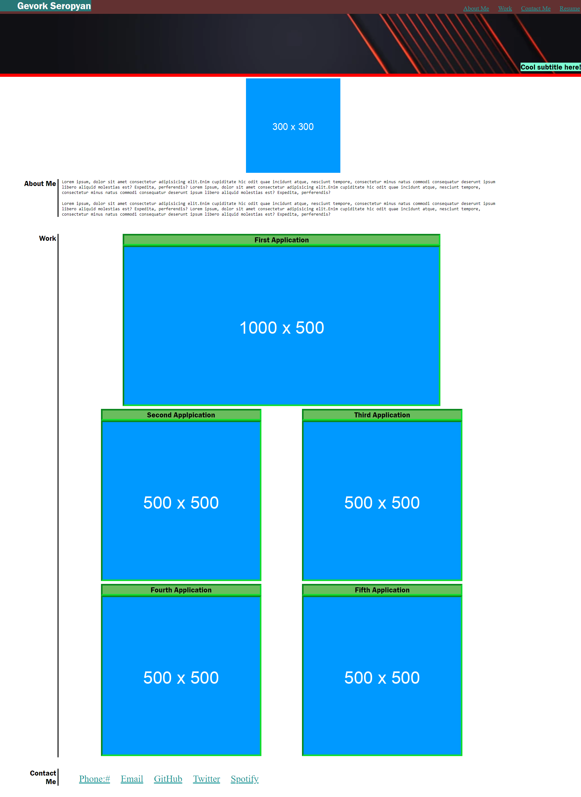

# Assessment-02

>## My Task
  Impliment HTML & CSS to create a portfolio webpage that employers can use to hire you

>## Code Style & Tech/Framework Used
 Implemted: Visual Studio IDE, Dev Tools

>## Demo

The following image shows the web application's appearance:

The webpage can be found at [My Portfolio](https://seropyan1995.github.io/Assess-2/)

>## Features
* Implemented newfound knkowledge of: flexbox, media queries, and CSS variables.
* Used semantic practices in the HTML and class/id naming and indention along with quality comments.
* Implemented a preview of my work, skills, and qualifications on a webpage made using the tools we've learned thus far in the coding bootcamp.
